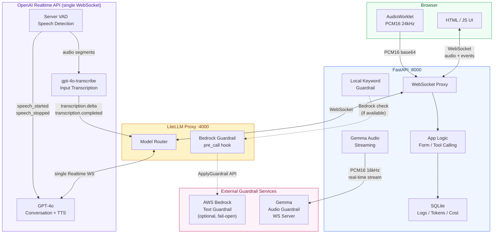
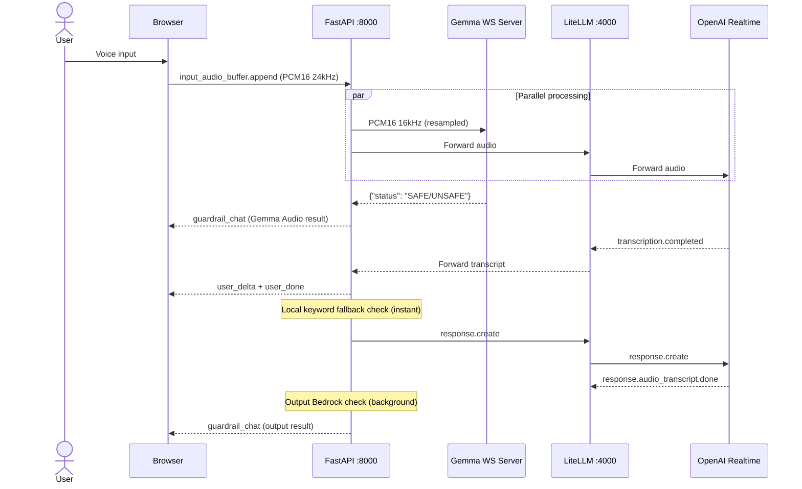
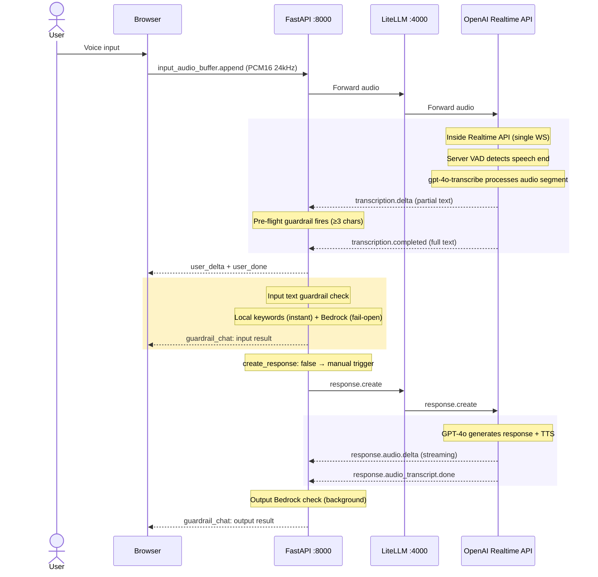
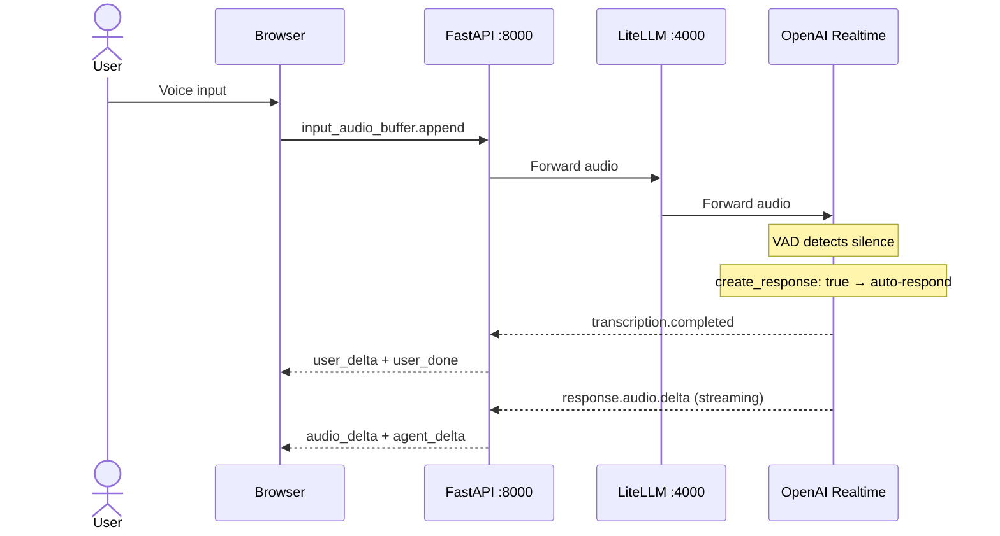
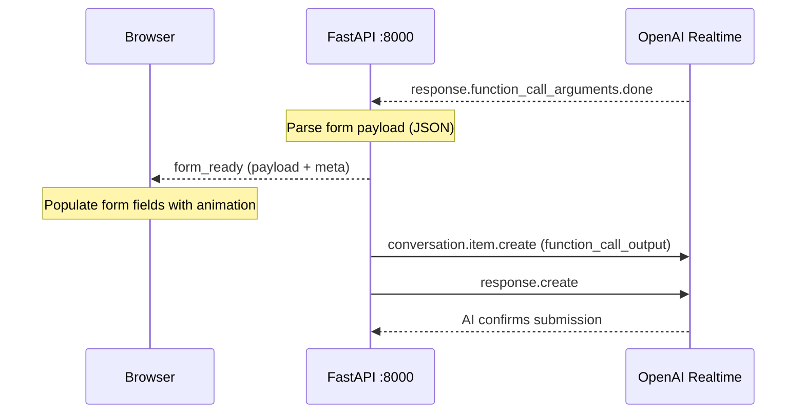

# Speech Form Filling System — Architecture Overview

## System Architecture



### OpenAI Realtime API — Internal Components

All processing happens within a **single WebSocket connection**. No separate API calls needed.

| Component | Role | Events |
|-----------|------|--------|
| **Server VAD** | Detects speech start/end, segments audio | `speech_started`, `speech_stopped`, `committed` |
| **gpt-4o-transcribe** | Transcribes segmented audio to text | `transcription.delta`, `transcription.completed` |
| **GPT-4o** | Understands context, generates response + TTS | `response.audio.delta`, `response.audio_transcript.delta` |

Configured via `session.update`:
```json
{
  "input_audio_transcription": {
    "model": "gpt-4o-transcribe",
    "language": "zh"
  },
  "turn_detection": {
    "type": "server_vad",
    "create_response": false
  }
}
```

- `input_audio_transcription.model` — which model transcribes user speech (no separate API call)
- `turn_detection.create_response` — `false` when guardrail is on (manually send `response.create` after check); `true` when guardrail is off (auto-respond)

---

## Guardrail Modes

| | Mode 1 `pre_check` | Mode 2 `post_check` | Guardrail OFF |
|---|---|---|---|
| **Input** | Gemma audio (real-time) + Local keyword fallback | Local keywords (instant) + Bedrock (fail-open) | No check |
| **Output** | Bedrock only (no local keywords) | Bedrock only (no local keywords) | No check |
| **create_response** | `false` (manual) | `false` (manual) | `true` (auto) |
| **Input latency** | ~0ms (parallel audio stream) + instant keyword check | ~1ms (local) + ~200-500ms (Bedrock, pre-flight optimized) | 0ms |

> Output guardrail skips local keywords to avoid false-blocking AI refusal messages (e.g. "I cannot help with bombs" contains "bombs").

---

## Sequence Diagram — Mode 1 (Audio Input Guardrail)



---

## Sequence Diagram — Mode 2 (Text Input Guardrail)



> **Note:** `gpt-4o-transcribe` and `GPT-4o` are **independent models** running inside the same Realtime API WebSocket. The transcript is generated separately from the model's understanding. Even if transcription is inaccurate, GPT-4o still processes the **original audio** directly and may respond correctly.

---

## Sequence Diagram — No Guardrail



---

## Sequence Diagram — Function Calling (submit_form)



---

## Text Guardrail — Two-Layer Check

```
Input text
   │
   ▼
Layer 1: Local keyword patterns (instant, always available)
   ├── Prompt injection (Chinese + English)
   ├── Data exfiltration / PII
   ├── Abuse / profanity (繁體 + 簡體 + English)
   ├── Violence / crime (繁體 + 簡體)
   ├── Expense fraud
   ├── Code injection
   └── Custom keywords (GUARDRAIL_BLOCK_KEYWORDS env)
   │
   ├─ BLOCKED → return immediately
   │
   ▼
Layer 2: Bedrock via LiteLLM (optional, fail-open)
   │
   ├─ BLOCKED → return
   ├─ ERROR → allow (fail-open)
   │
   ▼
PASSED
```

---

## Component Responsibilities

| Component | Type | Responsibilities |
|-----------|------|-----------------|
| **FastAPI** (:8000) | App server | UI, WebSocket proxy, Gemma audio streaming, local keyword guardrail, form logic, logs, `create_response` control |
| **LiteLLM** (:4000) | AI proxy | Model routing, Bedrock guardrail pre_call hook |
| **Gemma WS Server** | External WS | Audio-level safety (multimodal Gemma model) |
| **Bedrock Guardrail** | External API | Text safety — semantic understanding (optional, fail-open) |
| **OpenAI Realtime API** | External service | Speech understanding, AI conversation, TTS |

---

## Key Files

| File | Purpose |
|------|---------|
| `app/main.py` | FastAPI: WebSocket proxy, Gemma streaming, text guardrail orchestration, form, logs |
| `app/guardrails.py` | Local keyword patterns (繁體 + 簡體) + Bedrock integration |
| `audio_guardrail.py` | LiteLLM callback (no-op, kept for config compatibility) |
| `litellm_config.yaml` | LiteLLM: model routing + Bedrock guardrail registration |
| `start_litellm.py` | LiteLLM startup script |
| `static/app.js` | Frontend: audio capture, chat UI, form, guardrail display |
| `.env` | API keys, Bedrock config, Gemma WS URL |

---

## Startup

```bash
# 1. Start LiteLLM Proxy
uv run python start_litellm.py &

# 2. Start FastAPI
uv run uvicorn app.main:app --reload --port 8000
```

---

## Environment Variables

| Variable | Purpose |
|----------|---------|
| `OPENAI_API_KEY` | OpenAI API key (used by LiteLLM) |
| `LITELLM_PROXY_URL` | LiteLLM proxy URL (default: `ws://localhost:4000`) |
| `LITELLM_MASTER_KEY` | LiteLLM auth key |
| `GUARDRAIL_WS_URL` | Gemma audio guardrail WS URL (Mode 1) |
| `GUARDRAIL_API_KEY` | Gemma audio guardrail API key |
| `GUARDRAIL_BLOCK_KEYWORDS` | Additional comma-separated blocked keywords |
| `BEDROCK_GUARDRAIL_ID` | Bedrock guardrail ID (optional, fail-open) |
| `BEDROCK_GUARDRAIL_VERSION` | Bedrock guardrail version |
| `AWS_*` | AWS credentials (for Bedrock) |

---

## Risk Assessment

See [GUARDRAIL_RISKS.md](GUARDRAIL_RISKS.md) for details.
