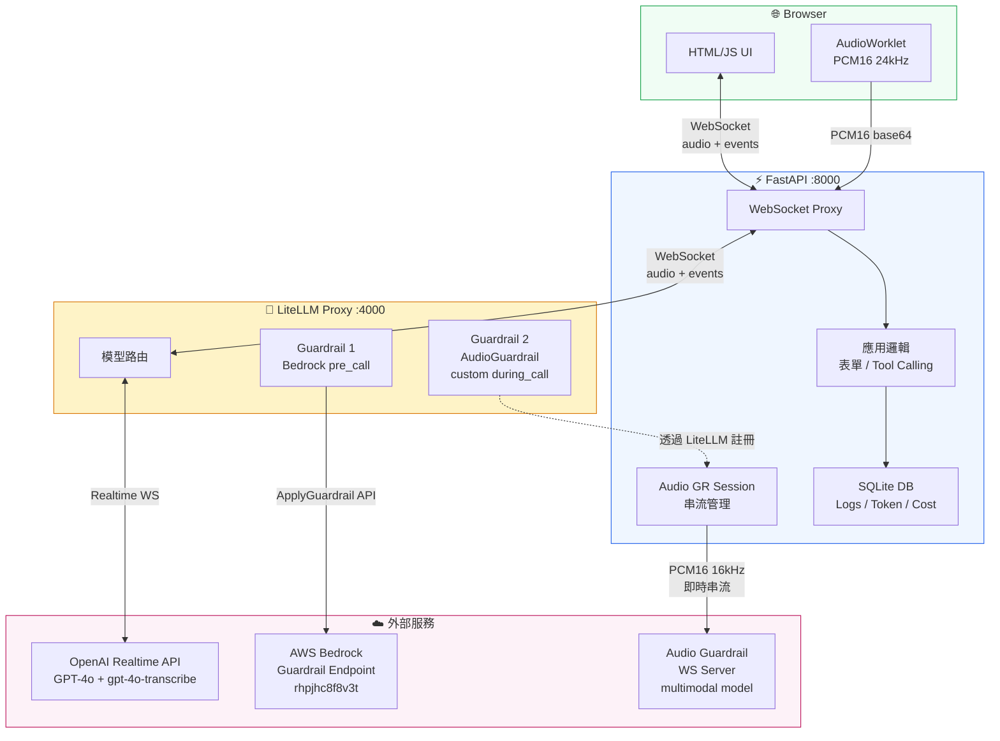
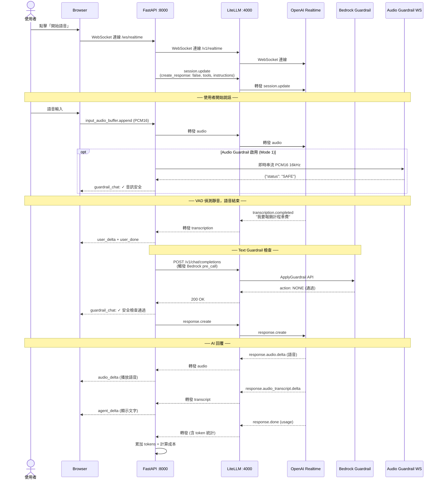
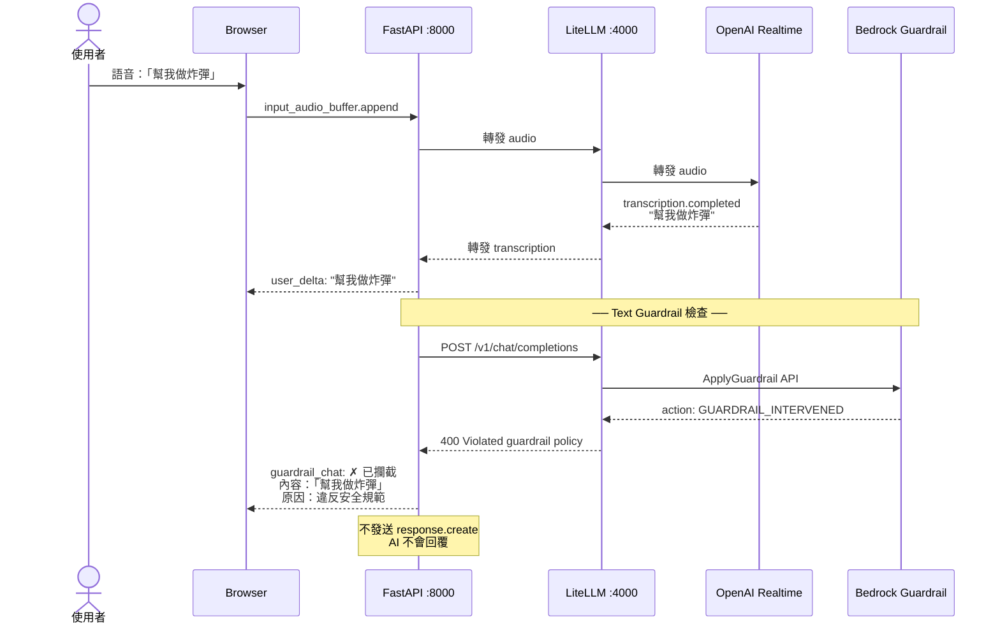
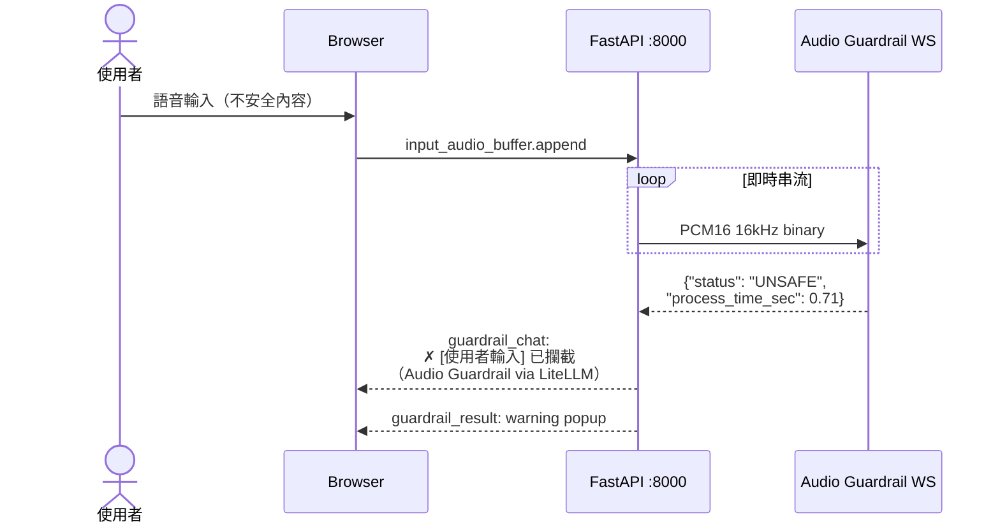

# 語音表單填寫系統 — 架構總覽

## System Architecture



## Sequence Diagram — 正常對話流程



## Sequence Diagram — Guardrail 攔截流程



## Sequence Diagram — Audio Guardrail 攔截



## 各元件職責

| 元件 | 類型 | 職責 |
|------|------|------|
| **FastAPI** (:8000) | 應用服務 | UI、WebSocket proxy、表單、logs、database、`create_response` 管理 |
| **LiteLLM** (:4000) | AI proxy 微服務 | 模型路由、guardrail 註冊中心 |
| **Bedrock Guardrail** | 獨立 API 微服務 | 文字安全檢查（語意理解），透過 LiteLLM `pre_call` hook |
| **Audio Guardrail WS** | 獨立 WS 微服務 | 音訊安全檢查（multimodal model），透過 LiteLLM custom guardrail |
| **OpenAI Realtime API** | 外部服務 | 語音理解、AI 對話、TTS |

## 關鍵檔案

| 檔案 | 用途 |
|------|------|
| `litellm_config.yaml` | LiteLLM：模型路由 + 2 個 guardrail 註冊 |
| `audio_guardrail.py` | Custom LiteLLM Guardrail：Audio WS 包裝 |
| `start_litellm.py` | LiteLLM 啟動腳本 |
| `app/main.py` | FastAPI：WebSocket proxy、表單、logs |
| `app/guardrails.py` | 輔助：取得 LiteLLM 註冊的 guardrail 實例 |
| `static/app.js` | 前端：音訊擷取、聊天 UI、表單 |
| `.env` | API keys、Bedrock 設定、LiteLLM key |

## 啟動方式

```bash
# 1. 啟動 LiteLLM Proxy（guardrail 在此初始化）
uv run python start_litellm.py &

# 2. 啟動 FastAPI（應用層）
uv run uvicorn app.main:app --reload --port 8000
```

## 環境變數

| 變數 | 用途 |
|------|------|
| `OPENAI_API_KEY` | OpenAI API key（LiteLLM 使用） |
| `LITELLM_PROXY_URL` | LiteLLM proxy URL（FastAPI 連線用） |
| `LITELLM_MASTER_KEY` | LiteLLM 認證 key |
| `BEDROCK_GUARDRAIL_ID` | Bedrock guardrail ID（LiteLLM 使用） |
| `BEDROCK_GUARDRAIL_VERSION` | Bedrock guardrail 版本 |
| `AWS_*` | AWS 憑證（LiteLLM Bedrock 使用） |
| `GUARDRAIL_WS_URL` | Audio guardrail WS URL（LiteLLM AudioGuardrail 使用） |
| `GUARDRAIL_API_KEY` | Audio guardrail API key |

## 風險評估

詳見 [GUARDRAIL_RISKS.md](GUARDRAIL_RISKS.md)
