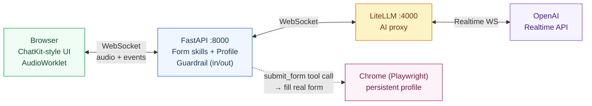

# Speech Form Filling Demo

Voice-driven assistant that fills internal HR / IT forms via OpenAI Realtime API + Playwright. Talk to the agent, it asks only what it doesn't already know, then opens the real form in Chrome and fills it for you to review and submit.

## What it does

1. Pick a form from the dropdown (`計程車費請領單`, `資訊作業申請`, `【金控】筆電申請單` — extensible)
2. Talk to the AI agent (繁體中文). It asks only the fields it can't pre-fill
3. Personal info (name / 員編 / e-mail / 部門 ...) is **auto-filled from the logged-in user profile** — the agent never asks for it
4. When all fields are confirmed, the agent calls `submit_form` → backend launches Chrome via Playwright (persistent profile, login persists), navigates to the real form, fills every field
5. **The agent does NOT click submit.** You review the filled form and click 送出 yourself
6. All sessions logged to `/logs.html` with token usage, cost, and full WebSocket event timeline

## Architecture



## Form Skills

Each form is a self-contained subpackage under `app/forms/`:

```
app/forms/
├── base.py                 # FormSkill dataclass + tool_schema generator
├── __init__.py             # Auto-discovery registry
├── taxi/
│   ├── __init__.py         # FormSkill instance
│   ├── schema.py           # Pydantic payload model
│   ├── instructions.md     # AI conversation rules for this form
│   └── fill.py             # async fill(page, payload) — Playwright logic
├── it_request/  ...
└── laptop/      ...
```

### Adding a new form

1. Create `app/forms/<form_id>/` with the four files above
2. In `__init__.py`, build a `FormSkill(...)` and assign it to `skill`
3. Done — registry picks it up at startup, frontend dropdown lists it

For complex forms with long-Chinese-string radio/checkbox values (e.g. laptop), keep a `{short_key: "verbatim 中文 value"}` mapping in `fill.py` so the AI only emits short keys.

## User Profile Auto-fill

`app/profile.py` exposes `get_current_profile()` returning a mock `UserProfile`. Each `FormSkill` can declare a `profile_defaults(profile, raw)` callable that returns `{payload_field: value}` defaults — these fill blanks **only** if the AI didn't supply them, so AI overrides are preserved (e.g. laptop form asks for the actual user's data when applying for someone else, not the logged-in user).

| Form | Auto-filled fields |
|---|---|
| `taxi` | (no personal fields) |
| `it_request` | `applicant` |
| `laptop` | `name`, `employeeId`, `contact`, `email`, `location` (only when `applicantIsUser=yes`) |

Plug a real SSO source by replacing the body of `get_current_profile()`. Override individual fields via env (`USER_PROFILE_NAME`, `USER_PROFILE_EMAIL`, etc.) for quick demo customisation.

## Guardrail

Optional keyword guardrail (toggle via UI checkbox) checks **both directions**:

- **Input** — user transcript checked before triggering the AI response. Blocked → no response.
- **Output** — agent transcript checked **streaming**. Hits a banned pattern mid-stream → `response.cancel` + `playback_stop` + AI cut off mid-sentence.

Pattern categories (see `app/guardrails.py` for full regex):

| Category | Example triggers |
|---|---|
| Prompt injection | `忽略你的指令`, `jailbreak`, `DAN` |
| Data exfiltration | `API key`, `密碼`, `列出所有使用者資料` |
| Abuse / profanity | (Chinese trad/simp + English) |
| Violence / crime | `製作炸彈`, `綁架`, `放火` |
| Expense fraud | `虛報費用`, `灌水金額` |
| Code injection | `DROP TABLE`, `<script>`, `UNION SELECT` |
| Custom | comma-separated `GUARDRAIL_BLOCK_KEYWORDS` env |

## Quick Start

### 1. Install

```bash
uv sync
uv run playwright install chrome
```

### 2. Configure `.env`

```env
OPENAI_API_KEY=sk-proj-...
LITELLM_MASTER_KEY=sk-anything-you-pick
```

Optional:

```env
DEFAULT_FORM_ID=taxi                    # which form is selected on first load
USER_PROFILE_NAME=陳小明
USER_PROFILE_EMPLOYEE_ID=E12345
USER_PROFILE_EMAIL=xiaoming.chen@example.com
GUARDRAIL_BLOCK_KEYWORDS=機密,內部專案    # additional keywords
```

### 3. Start the two services

```bash
# Terminal A — LiteLLM proxy (port 4000)
uv run python start_litellm.py

# Terminal B — FastAPI (port 8000)
uv run uvicorn app.main:app --reload --port 8000
```

### 4. Open browser

- App: http://localhost:8000/
- Logs: http://localhost:8000/logs.html

### 5. First-time login flow

The first `submit_form` triggers `app/browser.py` to launch Chrome with a persistent profile (`~/.chrome-debug-profile`). Log in to `staff.cathaylife.com.tw` once in that Chrome window — the session is saved and reused for all future fills.

## Dev tools

```bash
# Dump live form DOM (label / inputs / radios / checkboxes / dropdown options) for all configured URLs
uv run python scripts/dump_forms.py
# → /tmp/form_dump.json

# Test a single form's fill() with a hardcoded mock payload (no voice, no AI)
uv run python scripts/test_fill.py taxi          # or it_request / laptop
```

`dump_forms.py` is what you run when adding a new form: log in once via the launched Chrome, then read `/tmp/form_dump.json` to pin down selector strategy and option values.

## Available Realtime Models

| Model | Text In/Out (per 1M) | Audio In/Out (per 1M) |
|---|---|---|
| `gpt-4o-realtime-preview-2024-12-17` | $5.50 / $22.00 | $44.00 / $80.00 |
| `gpt-4o-realtime-preview-2024-10-01` | $5.50 / $22.00 | $110.00 / $220.00 |
| `gpt-4o-mini-realtime-preview-2024-12-17` | $0.66 / $2.64 | $11.00 / $22.00 |

Selectable from the model dropdown in the UI.

## Environment Variables

| Variable | Default | Description |
|---|---|---|
| `OPENAI_API_KEY` | — (required) | Used by LiteLLM proxy to talk to OpenAI |
| `LITELLM_MASTER_KEY` | — (required) | Auth between FastAPI and LiteLLM |
| `LITELLM_PROXY_URL` | `ws://localhost:4000` | LiteLLM Realtime endpoint base URL |
| `OPENAI_REALTIME_MODEL` | `gpt-4o-realtime-preview-2024-12-17` | Default Realtime model |
| `OPENAI_TRANSCRIBE_MODEL` | `whisper-1` | Whisper model for input transcription |
| `OPENAI_TRANSCRIBE_LANG` | `zh` | Transcription language code |
| `OPENAI_TRANSCRIBE_PROMPT` | (empty) | Whisper prompt for domain terms |
| `DEFAULT_FORM_ID` | `taxi` | Form selected on first page load |
| `FORM_URL` | (override `taxi` URL only) | Optional override of taxi form URL |
| `USER_PROFILE_NAME` | `陳小明` | Mock profile field |
| `USER_PROFILE_EMPLOYEE_ID` | `E12345` | Mock profile field |
| `USER_PROFILE_CONTACT` | `02-1234-5678 #6789` | Mock profile field |
| `USER_PROFILE_EMAIL` | `xiaoming.chen@cathaylife.com.tw` | Mock profile field |
| `USER_PROFILE_LOCATION` | `資訊處/AI應用科/瑞湖金融大樓/5樓` | Mock profile field |
| `USER_PROFILE_COMPANY` | `國泰金控` | Mock profile field |
| `GUARDRAIL_BLOCK_KEYWORDS` | (empty) | Comma-separated extra blocked keywords |
| `REQUESTS_DB_PATH` | `app/requests.db` | SQLite DB path for request/event log |

## API Endpoints

| Method | Path | Description |
|---|---|---|
| `GET` | `/api/forms` | List registered form skills (`id`, `label`, `description`, `url`) |
| `GET` | `/api/models` | Available Realtime models with pricing |
| `GET` | `/api/guardrail-info` | Guardrail config summary (for UI display) |
| `POST` | `/api/requests` | Persist a submitted form record |
| `GET` | `/api/requests` | List all submitted records |
| `GET` | `/api/requests/:id` | Single record detail |
| `DELETE` | `/api/requests/:id` | Delete a record |
| `DELETE` | `/api/requests` | Delete all records and events |
| `GET` | `/api/sessions` | Unified session list (WebSocket + submitted requests) |
| `GET` | `/api/ws-sessions` | List raw WebSocket sessions |
| `GET` | `/api/ws-sessions/:conn_id/events` | Full event timeline for one session |
| `DELETE` | `/api/ws-sessions/:conn_id` | Delete a WS session and its events |
| `POST` | `/api/client-errors` | Frontend error reporting endpoint |

### WebSocket

| Path | Description |
|---|---|
| `/ws/realtime?form=<id>&model=<id>&guardrail=keyword` | Conversation mode. `form` is required (defaults to `DEFAULT_FORM_ID`); `guardrail=keyword` enables the keyword guardrail (input + streaming output). |
| `/ws/realtime-stt` | Legacy STT-only stream (transcription only, no AI). |

## Branches

- `main` / `dev` — current production (multi-form skills + ChatKit UI + bidirectional guardrail)
- `feature/real-form-filling` — active development branch
- `poc/v1` — archived earlier PoC (LiteLLM monkey-patch + Bedrock/Gemma multimodal guardrails)
- `demo/simple-keyword-guardrail` — keyword-only demo cut

## Project Layout

```
app/
├── main.py                  # FastAPI app, WebSocket proxy, request log API
├── browser.py               # Playwright Chrome singleton + open_form_page()
├── profile.py               # UserProfile + get_current_profile()
├── guardrails.py            # check_text_local() — keyword regex
├── forms/                   # Form skills (see Form Skills section)
└── requests.db              # SQLite log (auto-created)
static/
├── index.html               # ChatKit-style chat UI
├── logs.html                # ChatKit-style logs page
├── app.js                   # WebSocket client + audio + chat rendering
├── logs.js                  # Logs page rendering
├── styles.css               # Original styles + .ck-body overlay
└── audio-processor.js       # PCM AudioWorklet
scripts/
├── dump_forms.py            # Live DOM dump for all forms
└── test_fill.py             # Per-form fill smoke test (no voice)
litellm_config.yaml          # LiteLLM proxy model registry
start_litellm.py             # LiteLLM proxy launcher
```
