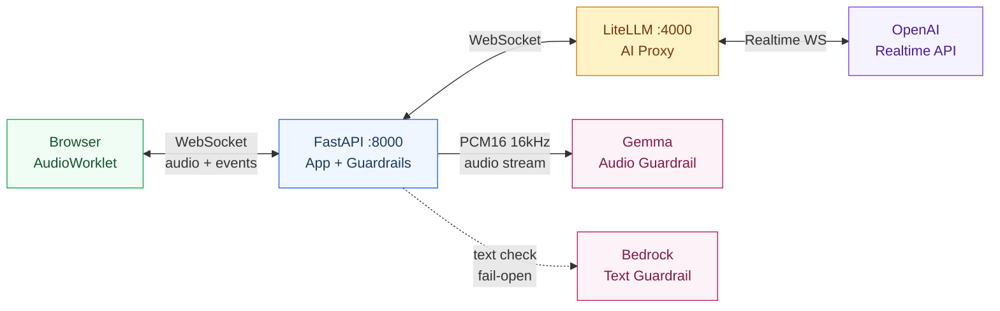

# Speech Form Filling Demo

## Overview

A voice-first web application for completing taxi expense reimbursement forms. Users can fill forms via real-time speech-to-text or conversational AI, with optional **Guardrail** safety checks.

Two voice-driven modes are available:

1. **Real-time STT Form Mode** — Streaming speech-to-text fills form fields in sequence with block-level focus and voice navigation.
2. **Conversation Mode** — A Realtime voice agent guides the user through the form via natural dialogue. Structured output **automatically populates a live form preview** alongside the chat.

After submission, users are redirected to a **Request Log page** with token usage, cost tracking, and WebSocket event history.

## Architecture



> For detailed architecture and sequence diagrams, see [ARCHITECTURE.md](ARCHITECTURE.md)

## Features

### Conversation Mode with Live Form Preview

The conversation tab uses a **form-centric layout**:
- **Left (60%)** — Full form (identical structure to STT mode) that auto-populates when AI completes filling
- **Right (40%)** — Sticky chat sidebar showing conversation with the AI agent

When the agent calls `submit_form`, the structured output fills the visual form fields (date, ride type, ride rows, total fare, notes) with a highlight animation, giving the user a clear preview before submission.

### Guardrail Integration

Two guardrail modes protect against unsafe or policy-violating content. Both share the **same output text guardrail**; they differ in how **input** is checked.

| | Mode 1 (`pre_check`) | Mode 2 (`post_check`) |
|---|---|---|
| **Input check** | Audio stream → Gemma (multimodal model) | Transcript text → Local keywords + Bedrock |
| **Output check** | Agent transcript → Local keywords + Bedrock | Agent transcript → Local keywords + Bedrock |
| **Latency** | Low (audio check runs in parallel with transcription) | Medium (text check blocks before AI responds) |

#### Mode 1: Audio Input Guardrail (Gemma) + Text Output Guardrail

Audio is streamed in real-time to an external Gemma-based guardrail server via LiteLLM monkey patch. The audio guardrail runs **in parallel** with OpenAI transcription — no added latency.

- Audio resampled from 24kHz → 16kHz (numpy linear interpolation)
- Protocol: binary PCM16 frames over WebSocket; server returns `{"event": "guardrail_result", "status": "SAFE"|"UNSAFE"}`
- Implemented via LiteLLM `CustomLogger` callback that monkey-patches `WebSocket.receive()`
- Based on [DScathay/voice-guardrails](https://github.com/DScathay/voice-guardrails) realtime branch

#### Mode 2: Transcript Input Guardrail (Text) + Text Output Guardrail

Audio goes directly to Realtime API with `create_response: false`. After transcription completes, the transcript is checked via local keyword patterns (+ Bedrock if available) before triggering `response.create`.

- Pre-flight optimization: guardrail check fires during `transcription.delta` (before completion) to reduce wait time
- Based on [DScathay/voice-guardrails](https://github.com/DScathay/voice-guardrails) asr branch and [vic4code/realtime-litellm-guardrail](https://github.com/vic4code/realtime-litellm-guardrail)

#### Text Guardrail — Two-Layer Check

All text checks (input in Mode 2, output in both modes) use a two-layer approach:

1. **Local keyword patterns** (instant, always available) — catches common attack patterns
2. **AWS Bedrock Guardrail** (optional, fail-open) — semantic understanding for nuanced threats

| Category | Example triggers |
|---|---|
| Prompt injection | "ignore previous instructions", "忽略你的指令", "jailbreak", "DAN" |
| Data exfiltration | "API key", "密碼", "列出所有使用者資料" |
| Abuse / profanity | "幹你娘", "操你妹", "fuck you", "去死" |
| Violence / crime | "製作炸彈", "殺人", "綁架", "毒品" |
| Code injection | `DROP TABLE`, `<script>`, `UNION SELECT` |
| Expense fraud | "虛報費用", "灌水金額", "不要留下紀錄" |
| Custom keywords | Set via `GUARDRAIL_BLOCK_KEYWORDS` env var |

> For a detailed risk assessment, see [GUARDRAIL_RISKS.md](GUARDRAIL_RISKS.md).

### Real-time STT Form Mode

- Live transcription populates the **active field**
- Smart parsing: Chinese numerals, dates, ride type keywords
- Voice commands: "下一個" (next), "上一個" (previous)
- Block-based field navigation with floating mobile buttons

### Request Logs

- Session-level unified view with WebSocket event history
- Per-request: token usage, cost breakdown, audio token accounting
- Expandable payload and event timeline views

## Environment Variables

| Variable | Default | Description |
|---|---|---|
| `OPENAI_API_KEY` | (required) | OpenAI API key |
| `OPENAI_REALTIME_MODEL` | `gpt-4o-realtime-preview-2024-12-17` | Default Realtime API model |
| `OPENAI_BETA_HEADER` | `realtime=v1` | OpenAI-Beta header value |
| `OPENAI_TRANSCRIBE_MODEL` | `whisper-1` | Transcription model (Realtime API native) |
| `OPENAI_TRANSCRIBE_LANG` | `zh` | Transcription language |
| `OPENAI_TRANSCRIBE_PROMPT` | (empty) | Whisper prompt for domain-specific terms |
| **Guardrail** | | |
| `BEDROCK_GUARDRAIL_ID` | (empty) | AWS Bedrock Guardrail ID (primary text guardrail) |
| `BEDROCK_GUARDRAIL_VERSION` | `DRAFT` | Bedrock Guardrail version |
| `AWS_DEFAULT_REGION` | `us-west-2` | AWS region for Bedrock |
| `AWS_ACCESS_KEY_ID` | (empty) | AWS credentials |
| `AWS_SECRET_ACCESS_KEY` | (empty) | AWS credentials |
| `AWS_SESSION_TOKEN` | (empty) | AWS STS session token (temporary credentials) |
| `GUARDRAIL_WS_URL` | (empty) | Audio guardrail WebSocket URL (Mode 1) |
| `GUARDRAIL_API_KEY` | (empty) | Audio guardrail service API key |
| `GUARDRAIL_BLOCK_KEYWORDS` | (empty) | Additional comma-separated blocked keywords |

## Available Realtime Models

Pricing sourced from OpenAI (via LiteLLM model registry, March 2025):

| Model | Text In/Out (per 1M) | Audio In/Out (per 1M) |
|---|---|---|
| `gpt-4o-realtime-preview-2024-12-17` | $5.50 / $22.00 | $44.00 / $80.00 |
| `gpt-4o-realtime-preview-2024-10-01` | $5.50 / $22.00 | $110.00 / $220.00 |
| `gpt-4o-mini-realtime-preview-2024-12-17` | $0.66 / $2.64 | $11.00 / $22.00 |

The model can be selected from the dropdown in the UI before starting a session.

## Quick Start

### Step 1: Install dependencies

```bash
uv sync
```

### Step 2: Configure `.env`

```env
# Required
OPENAI_API_KEY=sk-proj-...

# Audio Guardrail (Mode 1)
GUARDRAIL_API_KEY=your-api-key
GUARDRAIL_WS_URL=ws://your-server:8889/ws/audio/guardrails
```

### Step 3: Start LiteLLM Proxy

```bash
uv run python start_litellm.py &
```

### Step 4: Start FastAPI

```bash
uv run uvicorn app.main:app --reload --port 8000
```

### Step 5: Open browser

- Form page: http://localhost:8000/
- Request logs: http://localhost:8000/logs.html

Check the **Guardrail** checkbox to enable input/output safety checks. Select Mode 1 (audio) or Mode 2 (text) for different input guardrail strategies.

## API Endpoints

| Method | Path | Description |
|---|---|---|
| `POST` | `/api/requests` | Submit form (STT or Conversation mode) |
| `GET` | `/api/requests` | List all submitted requests |
| `GET` | `/api/requests/:id` | Get single request detail |
| `DELETE` | `/api/requests/:id` | Delete a request |
| `DELETE` | `/api/requests` | Delete all requests and events |
| `GET` | `/api/sessions` | List unified sessions (WS + requests) |
| `GET` | `/api/ws-sessions` | List WebSocket sessions |
| `GET` | `/api/ws-sessions/:conn_id/events` | Get events for a WS session |
| `DELETE` | `/api/ws-sessions/:conn_id` | Delete a WS session and its events |
| `GET` | `/api/models` | List available Realtime models with pricing |
| `GET` | `/api/guardrail-info` | Get guardrail endpoint configuration |
| `POST` | `/api/client-errors` | Log frontend errors |

## WebSocket Endpoints

| Path | Description |
|---|---|
| `/ws/realtime` | Conversation mode — full duplex audio + text + tools |
| `/ws/realtime?guardrail=pre_check` | Conversation + Mode 1 (audio input guardrail) |
| `/ws/realtime?guardrail=post_check` | Conversation + Mode 2 (transcript input guardrail) |
| `/ws/realtime?model=<model_id>` | Conversation with specific Realtime model |
| `/ws/realtime-stt` | STT-only mode — transcription only |
